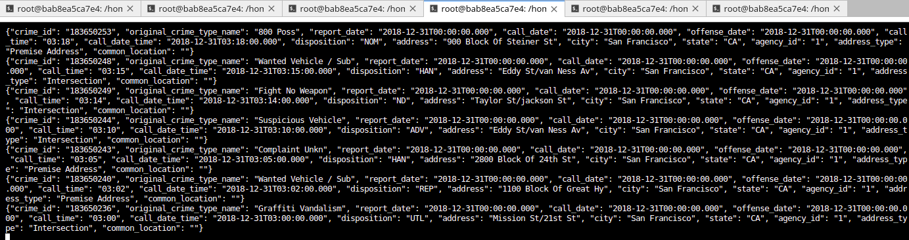

### SF Crime Statistics with Spark Streaming

Environment : Udacity Workspace

#### Introduction
Create an Streaming application with Spark that connects to a Kafka cluster, reads and process the data.

#### How to run:

1. Install requirements:
    Run on terminal:
    `./start.sh`
    
2. Start Zookeeper:
    Run on terminal:
    `/usr/bin/zookeeper-server-start ./config/zookeeper.properties`
    
3. Kafka server:
    Run on a seperate terminal command line:
    `/usr/bin/kafka-server-start ./config/server.properties`

4. Run producer:
    Run on terminal:
    `python kafka_server.py`
   
5. Kafka consumer:
    `kafka-console-consumer --bootstrap-server localhost:9092 --topic police.service.calls --from-beginning`
    
    Output:
    

6. The file `consumer_server.py` was created separately to check if `kafka_server.py` is working properly:

    Run `python consumer_server.py`
    
    Output:
    

6. Spark job:
    Run `spark-submit --packages org.apache.spark:spark-sql-kafka-0-10_2.11:2.3.4 --master local[*] data_stream.py`
   

### Answers the Questions :

1. How did changing values on the SparkSession property parameters affect the throughput and latency of the data?

By `processedRowsPerSecond`, the higher number we get on here, the more rows could be processed in second, also throughput. But it's also increase the time it takes to complete the batch. 

Then `processingTime` must be a value which is high enough to avoid that the trigger fires before the full batch is processed.

Another way to control throughput and latency is set up the `rowsPerSecond` and `numPartitions` by option on the stream.
    

2. What were the 2-3 most efficient SparkSession property key/value pairs? Through testing multiple variations on values, how can you tell these were the most optimal? 

Following Spark Performance Tuning (in this <a href="https://spark.apache.org/docs/latest/sql-performance-tuning.html">link</a>) we can make hypertuning over the parameters:
- spark.sql.shuffle.partitions 
- spark.streaming.kafka.maxRatePerPartition 
- spark.default.parallelism
... to maximize the `processedRowsPerSecond` in long run. 
